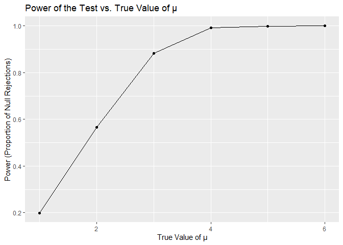
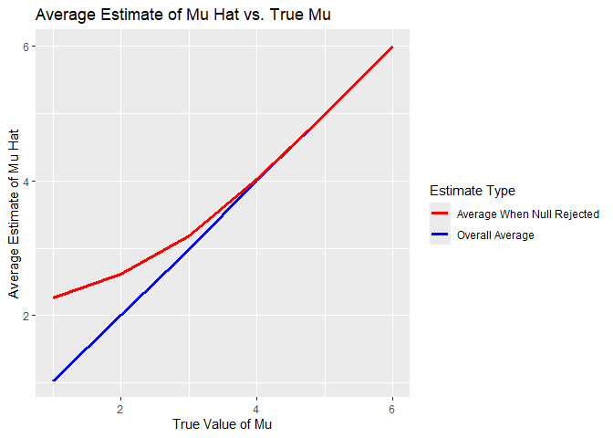

p8105_hw5_pm3260
================
Pradeeti Mainali

``` r
library(tidyverse)
```

    ## ── Attaching core tidyverse packages ──────────────────────── tidyverse 2.0.0 ──
    ## ✔ dplyr     1.1.4     ✔ readr     2.1.5
    ## ✔ forcats   1.0.0     ✔ stringr   1.5.1
    ## ✔ ggplot2   3.5.1     ✔ tibble    3.2.1
    ## ✔ lubridate 1.9.3     ✔ tidyr     1.3.1
    ## ✔ purrr     1.0.2     
    ## ── Conflicts ────────────────────────────────────────── tidyverse_conflicts() ──
    ## ✖ dplyr::filter() masks stats::filter()
    ## ✖ dplyr::lag()    masks stats::lag()
    ## ℹ Use the conflicted package (<http://conflicted.r-lib.org/>) to force all conflicts to become errors

``` r
library(dplyr)
library(ggplot2)
library(purrr)
set.seed(101)
```

# Problem 1: Practice

# Problem 2: Explore Power

``` r
sim_q2 = function(n = 30, mu = 0, sigma = 5) {
  
  sim_data = rnorm(n, mu, sigma)
  
  t_test = broom::tidy(t.test(sim_data, mu = 0))
  
  out_df =
    tibble(
      samp_mean = mean(sim_data),
      p_value = t_test$p.value 
    )
  # t_test$p.value is the name of the variable that will be made with the previous code. 
}

output = vector("list", 5000)

for (i in 1:5000) {
  
  output[[i]] = sim_q2()
  
}

results_df = bind_rows(output)
```

#### Raw data description

`results_df` has two columns with sample mean and p-value for each of
the 5000 data sets.

``` r
results2_df = 
  expand_grid(
    mu = c(1, 2, 3, 4, 5, 6),
    iter = 1:5000
  ) |> 
  mutate(results2_df = map(mu, ~sim_q2(n = 30, mu = .x, sigma = 5))) |> 
  unnest(results2_df) 
```

created a data set with sample mean and power for mu of 1,2,3,4,5 and 6.
This data set has 30,000 observations and four variables: mu, iter,
samp_mean, p_value

``` r
power_res = 
  results2_df |>
  group_by(mu) |>
  summarize(power = mean(p_value < 0.05))

  ggplot(power_res, aes(x = mu, y = power)) +
  geom_line() +
  geom_point() +
  labs(
    title = "Power of the Test vs. True Value of µ",
    x = "True Value of µ",
    y = "Power (Proportion of Null Rejections)"
  )
```

<!-- -->

As the true value of mu increases, power also increases. This graph
shows a positive association between effect size and power (larger
effect sizes are more detectable leading to a higher power)

``` r
avg_mean_df = 
  results2_df |>
  group_by(mu) |>
  summarize(
    avg_mu = mean(samp_mean),
    avg_mu_rej = mean(samp_mean[p_value < 0.05])
  )

ggplot(avg_mean_df, aes(x = mu)) +
  geom_line(aes(y = avg_mu, color = "Overall Average"), size = 1.2) +
  geom_line(aes(y = avg_mu_rej, color = "Average When Null Rejected"), size = 1.2) +
  labs(
    title = "Average Estimate of Mu Hat vs. True Mu",
    x = "True Value of Mu",
    y = "Average Estimate of Mu Hat",
    color = "Estimate Type"
  ) +
  scale_color_manual(values = c("Overall Average" = "blue", "Average When Null Rejected" = "red"))
```

    ## Warning: Using `size` aesthetic for lines was deprecated in ggplot2 3.4.0.
    ## ℹ Please use `linewidth` instead.
    ## This warning is displayed once every 8 hours.
    ## Call `lifecycle::last_lifecycle_warnings()` to see where this warning was
    ## generated.

<!-- -->

The sample average of mu hat across tests where the null was rejected is
not approximately equal to the true mu. This is especially for smaller
values of mu, where the mu hat was greater than the true mu for 1,2,3
and 4. This is likely due to selection bias. This bias diminishes as mu
increases, as the effect size makes it easier to reject the null
hypothesis across a broader range of sample.

# Problem 3: Homicides

``` r
homicide_df = 
  read.csv("data/homicide-data.csv") |>
  janitor::clean_names()
```

The raw data contains about 52k observations and 12 variables (uid,
reported_date, victim_last, victim_first, victim_race, victim_age,
victim_sex, city, state, lat, lon, disposition). Out of the victims,
7209 are females, 40739 were males, and there are 4231 unknowns. There
is one state abr that is not capitalized like the rest (wl), but I don’t
think its a big issue aside from aesthetics.

#### MD proportion of homicides that are unsolved

``` r
homicide_sum =
  homicide_df |>
  mutate(city_state = str_c(city, ", ", state),
         unsolved = disposition %in% c("Closed without arrest", "Open/No arrest")) |>
  group_by(city_state) |>
  summarize(
    total_homicides = n(),
    unsolved_homicides = sum(unsolved, na.rm = TRUE))


unsolved_prop = function(city_st) {
 
  city_data =
  homicide_sum |>
  filter(city_state == city_st)
  
  test_result = prop.test(x = pull(city_data, unsolved_homicides),
                          n = pull(city_data, total_homicides))
  tidy_result = 
    broom::tidy(test_result) |>
    select(estimate, conf.low, conf.high)
  
  return(tidy_result)
}

baltimore_results = unsolved_prop("Baltimore, MD")
```

#### Estimates and CI’s for each city

``` r
allcities_results = 
  homicide_sum |>
  mutate(
    test_result = map2(
      unsolved_homicides,
      total_homicides,
      ~ prop.test(x = .x, n = .y)
    ),
    tidy_result = map(test_result, ~ broom::tidy(.x))
  ) |>
  unnest(tidy_result) |>
  select(city_state, estimate, conf.low, conf.high)
```

    ## Warning: There was 1 warning in `mutate()`.
    ## ℹ In argument: `test_result = map2(...)`.
    ## Caused by warning in `prop.test()`:
    ## ! Chi-squared approximation may be incorrect

``` r
print(allcities_results)
```

    ## # A tibble: 51 × 4
    ##    city_state      estimate conf.low conf.high
    ##    <chr>              <dbl>    <dbl>     <dbl>
    ##  1 Albuquerque, NM    0.386    0.337     0.438
    ##  2 Atlanta, GA        0.383    0.353     0.415
    ##  3 Baltimore, MD      0.646    0.628     0.663
    ##  4 Baton Rouge, LA    0.462    0.414     0.511
    ##  5 Birmingham, AL     0.434    0.399     0.469
    ##  6 Boston, MA         0.505    0.465     0.545
    ##  7 Buffalo, NY        0.612    0.569     0.654
    ##  8 Charlotte, NC      0.300    0.266     0.336
    ##  9 Chicago, IL        0.736    0.724     0.747
    ## 10 Cincinnati, OH     0.445    0.408     0.483
    ## # ℹ 41 more rows

There is an error with this code because Tulsa, AL has only 1
observation, which is not ideal for chi-squared approximation. However,
the code still works on the rest of the city states.

#### Plot: Estimates and CI’s for each city

``` r
homicide_plot =
  allcities_results |>
  arrange(estimate) |>
  mutate(city_state = factor(city_state, levels = city_state))

ggplot(homicide_plot, aes(x = city_state, y = estimate)) +
  geom_point(size = 2, color = "black") +
  geom_errorbar(aes(ymin = conf.low, ymax = conf.high), width = 0.3, color = "red") +  
  coord_flip() +  
  labs(
    title = "Proportion of Unsolved Homicides by City",
    x = "City, State",
    y = "Proportion of Unsolved Homicides with Error Bars",
    caption = "Data Source: Washington Post Homicide Data"
  ) +
  theme_minimal() 
```

<!-- -->
