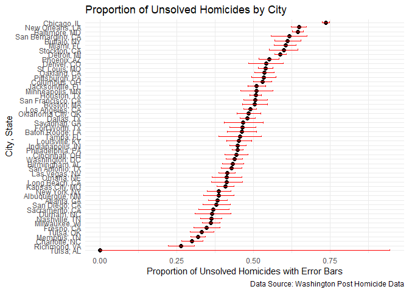

p8105_hw5_pm3260
================
Pradeeti Mainali

``` r
library(tidyverse)
```

    ## ── Attaching core tidyverse packages ──────────────────────── tidyverse 2.0.0 ──
    ## ✔ dplyr     1.1.4     ✔ readr     2.1.5
    ## ✔ forcats   1.0.0     ✔ stringr   1.5.1
    ## ✔ ggplot2   3.5.1     ✔ tibble    3.2.1
    ## ✔ lubridate 1.9.3     ✔ tidyr     1.3.1
    ## ✔ purrr     1.0.2     
    ## ── Conflicts ────────────────────────────────────────── tidyverse_conflicts() ──
    ## ✖ dplyr::filter() masks stats::filter()
    ## ✖ dplyr::lag()    masks stats::lag()
    ## ℹ Use the conflicted package (<http://conflicted.r-lib.org/>) to force all conflicts to become errors

``` r
library(ggplot2)
set.seed(101)
```

# Problem 1: Practice

# Problem 2: Explore Power

``` r
sim_q2 = function(n = 30, mu = 0, sigma = 5) {
  
  sim_data = rnorm(n, mu, sigma)
  
  t_test = broom::tidy(t.test(sim_data, mu = 0))
  
  out_df =
    tibble(
      samp_mean = mean(sim_data),
      p_value = t_test$p.value 
    )
  # t_test$p.value is the name of the variable that will be made with the previous code. 
}

output = vector("list", 5000)

for (i in 1:5000) {
  
  output[[i]] = sim_q2()
  
}

results_df = bind_rows(output)
```

`results_df` has two columns with sample mean and p-value for each of
the 5000 data sets.

``` r
results2_df = 
  expand_grid(
    mu = c(1, 2, 3, 4, 5, 6),
    iter = 1:5000
  ) |> 
  mutate(results2_df = map(mu, ~sim_q2(n = 30, mu = .x, sigma = 5))) |> 
  unnest(results2_df) 
```

created a data set with sample mean and power for mu of 1,2,3,4,5 and 6.
This data set has 30,000 observations and four variables: mu, iter,
samp_mean, p_value

``` r
power_res = 
  results2_df |>
  group_by(mu) |>
  summarize(power = mean(p_value < 0.05))

  ggplot(power_res, aes(x = mu, y = power)) +
  geom_line() +
  geom_point() +
  labs(
    title = "Power of the Test vs. True Value of µ",
    x = "True Value of µ",
    y = "Power (Proportion of Null Rejections)"
  )
```

<!-- -->

As the true value of mu increases, power also increases. This graph
shows a positive association between effect size and power (larger
effect sizes are more detectable leading to a higher power)

# Problem 3: Homicides

#### Raw data description

#### Total number of homicides and unsolved homicides

#### MD proportion of homicides that are unsolved

#### Plot: Estimates and CIs for each city
